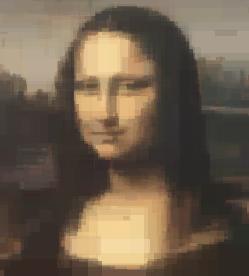
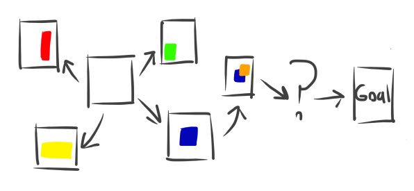
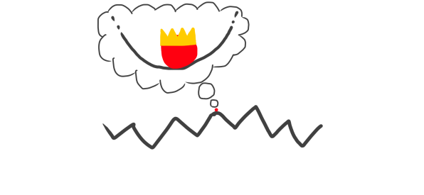
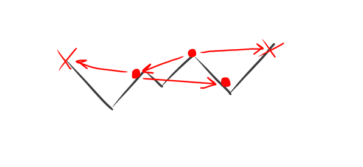
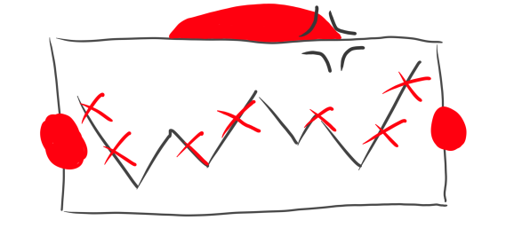
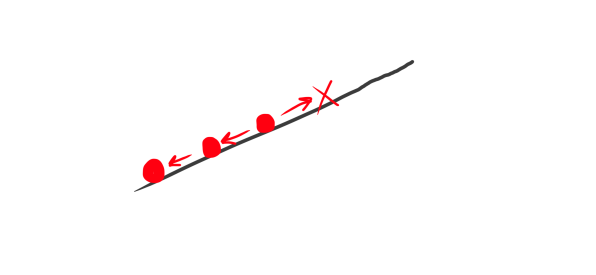
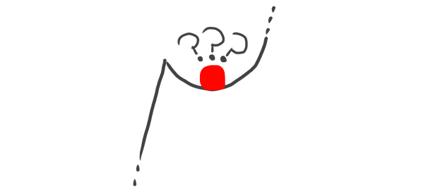
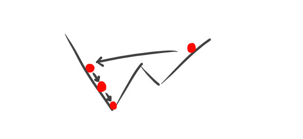
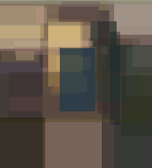

# Approximating Images With Geometric Shapes
While researching the topics of search and optimisation, I came across an interesting problem. The challenge is to approximate a given base image as accurately as possible using simple geometric shapes. There are many possible solutions, and I'll be going over the simplest one.

 

## The Problem
Our initial state is a blank image, our ideal state is one with the lowest possible distance from the target image, and we can move through the state space by drawing shapes onto our current state image. 



It's difficult to know where to start, so we'll look at a much simpler search problem first.

## A Much Simpler Example
Imagine you're a creature living in a world with 2 dimensions. The world is very large and filled with hills of various heights. Your goal is get your y coordinate as low as possible. The only sense you have is your current position (x, y), and you can move to any other x coordinate on the surface of the world instantly. So, what's the best way to get as low as possible? 



## A Bad Strategy
Since you can move anywhere, you could move to a random x coordinate, staying there if your y-position decreased and going back if it increased. Repeating this will gradually get you lower.



The problem is, though, the lower you are, the less likely that a random point will be lower than you. More and more moves you make will end up increasing your y, and getting to the lowest point using this method would take a ridiculous amount of time.



## A Worse Strategy
You could also move a small amount in a random direction (+x, -x), and stay only if your y-position decreased. Repeating this will get you to a point where moving in either direction will not get you to a lower point. This process is called *hill climbing*. 



It's not ideal though, since there's no guarantee that this will get you to the lowest point. You could be stuck in a *local minimum* where a lower point is inaccessible because the way there would increase our y.



## Combined
As weak as these two approaches are, if we combine them, it actually becomes quite good. We employ the second strategy on the position we get from the first. The drawbacks of the second are nullified by the first, since we'll be taken to the local minimum of each random position. This approach is very likely to find the global minimum given enough iterations.



## Back to Images
The image redrawing problem is similar, but with a much more complicated search space. 
We want to minimise our 'distance', which is euclidian distance without the square root, as it's not needed for our problem. The function is:
$$d = \sum_{i=0}^n(target_{i} - current_{i})^2$$
where $target$ and $current$ are the data of the images as vectors.
Our 'moving' is drawing a shape with any position, size and colour onto the current image. For my implementation, I used rectangles.

## The Solution

We draw a rectangle with random corner positions and colour. We then use hill climbing to make many random incremental changes to the rectangle, only accepting changes that decrease the distance. We'll do the hill climbing separately for colour and position, as this keeps the changes small.
```
// Some pseudocode
image = blank image
dist  = (distance between target and image)
for each step {
    r = (random rectangle)
    i = (image with r)
    d = (distance between target and i)

    for both colour and position {
        for each hill climb step {
            nr = (small change to r)
            ni = (image with nr)
            nd = (distance between target and ni)
            if nd < d {
                r, i, d = nr, ni, nd
            }
        }
    }

    if d < dist {
        image, dist = i, d
    }
}
```
What ends up happening is the shapes adjust themselves to contribute as much as possible to the image, and the detail increases as more shapes are added. The more hill climbing steps, the more optimal each shape will be.



## Implementation
I wrote a very minimal implementation in python. It depends on PIL and numpy.
```py
#!/usr/bin/env python3
import random as rnd
import numpy as np
from PIL import Image, ImageDraw
from dataclasses import dataclass

NUM_STEPS               = 500
NUM_HILL_CLIMBING_STEPS = 1000
COLOUR_MAX_CHANGE       = 30
POSITION_MAX_CHANGE     = 30
A_MIN                   = 100
A_MAX                   = 255
VERBOSE_OUTPUT          = True
IMAGE_NAME              = "image.png"

@dataclass
class Rect:
    ax: int
    ay: int
    bx: int
    by: int
    r:  int
    g:  int
    b:  int
    a:  int

    def copy(self):
        return Rect(**self.__dict__)

    def mutate_colour(self):
        self.r = clamp(self.r + random_delta(COLOUR_MAX_CHANGE), 0, 255)
        self.g = clamp(self.g + random_delta(COLOUR_MAX_CHANGE), 0, 255)
        self.b = clamp(self.b + random_delta(COLOUR_MAX_CHANGE), 0, 255)
        self.a = clamp(self.a + random_delta(COLOUR_MAX_CHANGE), A_MIN, A_MAX)

    def mutate_position(self, mx, my):
        self.ax = clamp(self.ax + random_delta(POSITION_MAX_CHANGE), 0, mx)
        self.ay = clamp(self.ay + random_delta(POSITION_MAX_CHANGE), 0, my)
        self.bx = clamp(self.bx + random_delta(POSITION_MAX_CHANGE), 0, mx)
        self.by = clamp(self.by + random_delta(POSITION_MAX_CHANGE), 0, my)

def random_delta(x):
    return rnd.randint(-x, +x)

def clamp(v, min_v, max_v):
    return max(min_v, min(max_v, v))

def get_distance(target, image):
    as_array = np.array(image, dtype=np.uint32)
    return np.square(target - as_array).sum()

def draw(current, target, rect):
    # Draw the rect to a transparent image
    colour  = (rect.r, rect.g, rect.b, rect.a)
    points  = [(rect.ax, rect.ay), (rect.bx, rect.by)]
    overlay = Image.new("RGBA", current.size, (0, 0, 0, 0))
    draw    = ImageDraw.Draw(overlay)
    draw.rectangle(points, colour)

    # Combine the overlay with the base and calculate the new distance
    new_image    = Image.alpha_composite(current, overlay)
    new_distance = get_distance(target, new_image)
    return new_image, new_distance

def next_state(current, target):
    width, height = current.size

    # Draw a random rectangle
    rect = Rect(
        ax = rnd.randint(0, width), 
        ay = rnd.randint(0, width), 
        bx = rnd.randint(0, width), 
        by = rnd.randint(0, width), 
        r  = rnd.randint(0, 255),  
        g  = rnd.randint(0, 255),  
        b  = rnd.randint(0, 255),  
        a  = rnd.randint(A_MIN, A_MAX)
    )
    image, distance = draw(current, target, rect)

    # Optimise the rectangle 
    col = lambda r : r.mutate_colour()
    pos = lambda r : r.mutate_position(width-1, height-1)

    for mutate in [col, pos]:
        for i in range(NUM_HILL_CLIMBING_STEPS):
            # Copy the rect and mutate it
            copy = rect.copy()
            mutate(copy)
            mutation_image, mutation_distance = draw(current, target, copy)
            
            # If it's better, accept it
            if mutation_distance < distance:
                image    = mutation_image
                distance = mutation_distance
                rect     = copy

    return image, distance

def main():
    target_image  = Image.open(IMAGE_NAME).convert("RGBA")
    target        = np.array(target_image, dtype=np.uint32)

    # Start with a blank image and infinite distance
    image    = Image.new("RGBA", target_image.size, (255, 255, 255, 255))
    distance = get_distance(target, image)
    image.save("new0.png")

    for step in range(NUM_STEPS):
        print(f"step {step}")
        print(f"starting with distance of {distance}")
 
        new_image, new_distance = next_state(image, target)

        if new_distance < distance:
            print(f"distance decreased by {distance-new_distance}")
            print(f"new distance is {new_distance}")

            distance = new_distance
            image    = new_image
            image.save(f"new{step+1}.png")
        else:
            print("failed to decrease distance, new state rejected")

main()
```

## Results
For such a simple implementation, we can get some very nice results. This was the result of ~500 rectangles and ~15 minutes of computation.


## Potential Improvements
This is only the most basic implementation, and there are a lot of areas to improve things.
- **Using a better distance function**: Euclidian distance works well for situations where changes in every component are of equal consequence, but this isn't the case for colour values. The human eye has different sensitivities to red, green and blue light. This could be addressed by using a colour difference function which accounts for human perception, such as [redmean](https://en.wikipedia.org/wiki/Color_difference).
- **Simulated annealing**: This is a search method which sometimes accepts increases in distance, making it easier to escape local minima. The probability that a worse state is accepted is proportional to a 'temperature' which cools over time as the search progresses. This is where the *annealing* name comes from. Using this while hill climbing will lead to each rectangle becoming more optimal.
- **Performance**: Being just a simple python script, my implementation naturally isn't the fastest. With a more performant implementation you could perform far more hill climbing steps in the same amount of time, as well as work with larger images.

## More Implementations
- https://github.com/fogleman/primitive : Go, hill climbing and simulated annealing.
- https://github.com/SebastianCharmot/Genetic-Algorithm-Image-Recreation : Python, genetic algorithm