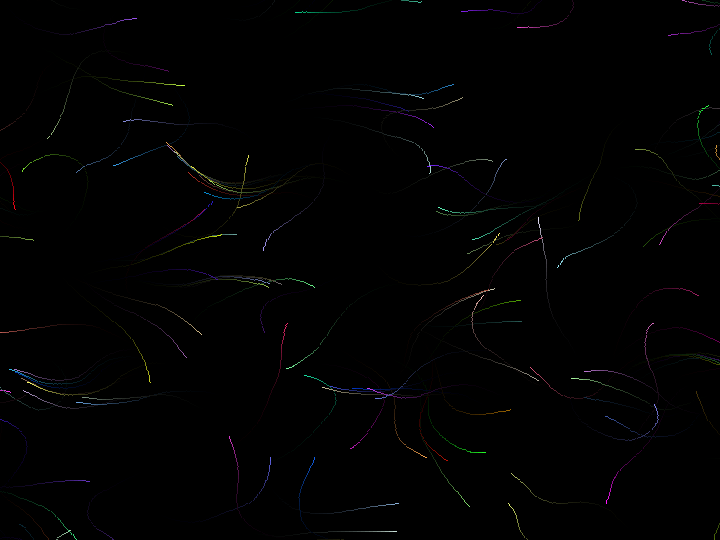

# Introduction
> What I cannot create, I do not understand
>
> -- Richard P. Feynman

This will be a place for me to write about various scientific and mathematical topics, with a focus on DIY projects. I'm a strong believer in 'learning by doing' with practical work.

## What will be covered?
Computer science is the field that I have formal education in, and will be my main focus. I'm a keen programmer, my favourite languages being C, C++, Python and Haskell. I also use programming to learn about other subjects by creating simulations.

